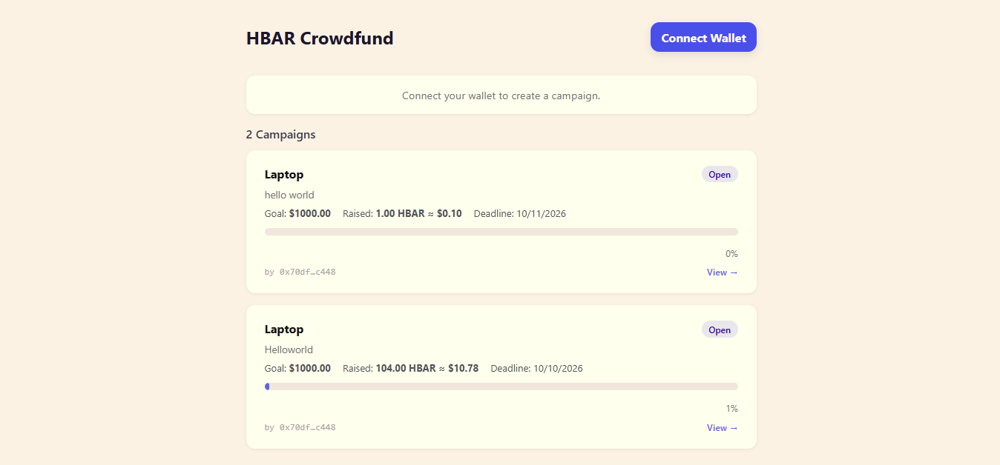

# USD-HBAR Crowdfunding — Scaffold-HBAR Template

A **multi-campaign USD-denominated crowdfunding platform** on Hedera Testnet, powered by a Chainlink HBAR/USD oracle. Deploy the factory once — users create unlimited campaigns from the UI with shareable URLs.

---
# Real-world Use Case 
Community drives · school projects · emergency funds · small creative campaigns.

## Quick Start

### Step 1 — Scaffold the project

```bash
npm create scaffold-hbar@latest --template wiseman-umanah/Scaffold-HBAR-Template-Crowdfunding
# or
pnpm create scaffold-hbar@latest --template wiseman-umanah/Scaffold-HBAR-Template-Crowdfunding
```

This clones the repo and runs `pnpm install` automatically.

---

### Step 2 — Get your prerequisites

Before running anything, make sure you have:

| Requirement | How to get it |
|---|---|
| Node.js >= 20.18.3 | [nodejs.org](https://nodejs.org) |
| pnpm >= 9 | `npm install -g pnpm` |
| Hedera testnet account | [Hedera Portal](https://portal.hedera.com/) — sign up, create testnet account |
| Testnet HBAR | Portal faucet (free) — fund your ECDSA address |
| ECDSA private key | Export from MetaMask, HashPack wallet settings, or `cast wallet new` |
| WalletConnect project ID | Free at [cloud.walletconnect.com](https://cloud.walletconnect.com) |

> **Important:** Your ECDSA address needs at least one inbound HBAR before it can deploy. If deploy fails with `Sender account not found`, fund the address from the Portal faucet first.

---

### Step 3 — Configure the contract deployer

```bash
cp packages/hardhat/.env.example packages/hardhat/.env
```

Edit `packages/hardhat/.env` and fill in:

```env
HARDHAT_PRIVATE_KEY=0x...   # your ECDSA private key
```

---

### Step 4 — Deploy the factory contract

The factory is deployed **once**. It creates individual campaign contracts on-demand from the UI.

```bash
cd packages/hardhat
pnpm run deploy:factory
```

The script will print output like this:

```
CrowdfundFactory deployed: 0xABC...
HashScan: https://hashscan.io/testnet/contract/0xABC...

Add to packages/frontend/.env.local:
NEXT_PUBLIC_FACTORY_ADDRESS=0xABC...
NEXT_PUBLIC_FACTORY_DEPLOY_BLOCK=12345678
```

**Copy both printed values** — you need them in the next step.

---

### Step 5 — Configure the frontend

```bash
cp packages/frontend/.env.example packages/frontend/.env.local
```

Edit `packages/frontend/.env.local` and fill in all three values:

```env
NEXT_PUBLIC_FACTORY_ADDRESS=0xABC...        # from Step 4 output
NEXT_PUBLIC_FACTORY_DEPLOY_BLOCK=12345678   # from Step 4 output
NEXT_PUBLIC_WALLETCONNECT_PROJECT_ID=...    # from cloud.walletconnect.com
```

---

### Step 6 — Start the frontend

```bash
cd packages/frontend
pnpm dev
```

Open **http://localhost:3000** in your browser. Connect your wallet (MetaMask or HashPack on Hedera Testnet, chain ID 296) and you're live.

---

## What happens next (UI flow)

1. **Gallery** (`/`) — see all campaigns. Click **Create Campaign** to launch a new one.
2. **Create** — enter title, description, USD goal, and duration. This deploys a new campaign contract; you are redirected to its page.
3. **Contribute** — enter HBAR amount (or toggle to type USD; live conversion via Chainlink).
4. **Finalize** — any wallet calls this after the deadline. The oracle is read once; result is permanent.
5. **Withdraw** (organiser, if goal met) or **Refund** (each contributor, if goal not met).
6. **Share** the campaign URL (`/campaign/0x…`) — title and description always load, no login needed.

---

## Other useful commands

```bash
# Run the full test suite (no network needed — uses local Hardhat EVM)
cd packages/hardhat
pnpm test

# Run a single test file
pnpm hardhat test test/UsdGoalCrowdfund.ts
pnpm hardhat test test/CrowdfundFactory.ts

# Compile contracts only
pnpm compile
```

---

## What this is (background)

- One `CrowdfundFactory` is deployed **once** (Step 4). It stores the Chainlink feed address.
- Users call `createCampaign()` from the UI — each call deploys a fresh `UsdGoalCrowdfund` contract.
- Contributors send native HBAR only — no tokens, no DEX, no WHBAR.
- After the deadline **anyone** calls `finalize()`. The Chainlink feed is read **exactly once** and the result is final.
- **Goal met** → organiser withdraws the pot. **Goal not met** → every contributor gets a full refund.

Real-world uses: community drives · school projects · emergency funds · creative campaigns.

---

## Contract & Oracle Addresses

| Item | Address |
|---|---|
| Chainlink HBAR/USD feed (testnet) | `0x59bC155EB6c6C415fE43255aF66EcF0523c92B4a` |
| Deployed factory | _see `packages/hardhat/deployments/hedera_testnet.json` after deploy_ |

HashScan proof: _https://hashscan.io/testnet/contract/0xb6136d979D027690031E3E9d86a02c548498D1A9_

---

## Unit Notes

- **HBAR decimals on-chain:** 18 — Hashio exposes native HBAR as wei-style (just like ETH).
- **Chainlink feed decimals:** 8 — e.g., answer `10150000` = $0.1015 per HBAR.
- **goalUsd decimals:** 8 — e.g., `1_000_000_000` = $10.00.
- **USD raised formula:** `usdRaised = (totalRaised × answer) / 1e18`
- **HashPack tinybar quirk:** HashPack divides `msg.value` by `1e10` on the way to the chain. On-chain balances are in tinybars; the frontend multiplies all HBAR reads by `10_000_000_000` for display.

### Volatility disclaimer

`goalMet` is determined by the **single** oracle price read inside `finalize()`. If HBAR price changes significantly between contributions and finalisation, the outcome may differ from contributor expectations. This is by design.

---

## Architecture

```
packages/
├── hardhat/
│   ├── contracts/
│   │   ├── CrowdfundFactory.sol      ← deployed once; users call createCampaign() from UI
│   │   ├── UsdGoalCrowdfund.sol      ← one instance per campaign
│   │   └── interfaces/
│   │       └── AggregatorV3Interface.sol
│   ├── scripts/deployFactory.ts      ← the only deploy script
│   ├── test/
│   │   ├── UsdGoalCrowdfund.ts
│   │   └── CrowdfundFactory.ts
│   └── deployments/hedera_testnet.json
└── frontend/                         ← Next.js 14 App Router + wagmi + RainbowKit
    └── src/
        ├── app/
        │   ├── page.tsx              ← gallery + CreateCampaignForm (/)
        │   ├── campaign/[address]/   ← shareable /campaign/:address
        │   ├── layout.tsx            ← root layout, wraps Providers
        │   └── providers.tsx         ← wagmi + RainbowKit singleton providers
        ├── components/
        │   ├── ActionButtons.tsx     ← finalize / withdraw / refund buttons
        │   ├── CampaignCard.tsx      ← campaign detail stats card
        │   ├── CampaignPreviewCard.tsx ← gallery preview tile
        │   ├── ContributeForm.tsx    ← HBAR/USD dual-input contribute form
        │   ├── ContributorList.tsx   ← ranked contributor leaderboard
        │   └── CreateCampaignForm.tsx ← campaign creation form
        ├── hooks/
        │   ├── useCampaign.ts        ← all contract reads + useHbarPrice
        │   ├── useCampaignMeta.ts    ← title/description from Mirror Node
        │   ├── useFactory.ts         ← campaign list from Mirror Node
        │   └── useContributors.ts    ← contributor leaderboard from Mirror Node
        └── config/
            ├── chains.ts             ← Hedera Testnet viem chain (id: 296)
            └── abi.ts                ← CROWDFUND_ABI + FACTORY_ABI
```

### Event log reads — Mirror Node, not eth_getLogs

Hedera Hashio `eth_getLogs` is limited to ~7 days of blocks (block "numbers" are packed timestamps, not sequential). All event log reads (`CampaignCreated`, `Contributed`) use the **Hedera Mirror Node REST API** (`https://testnet.mirrornode.hedera.com`).

---

## Demo Path

1. Fund deployer address from [Hedera Portal](https://portal.hedera.com/).
2. Deploy factory with `pnpm run deploy:factory`.
3. Set env vars, start `pnpm dev`.
4. Create a campaign with a short deadline (e.g. 1 minute for testing).
5. Use 2–3 funded contributor addresses; contribute various HBAR amounts.
6. After deadline, click **Finalize** in the UI.
7. **Withdraw** (organiser) or **Refund** (contributors).
8. Capture HashScan links for factory deploy, campaign deploy, contribute, finalize, and withdraw/refund transactions.
